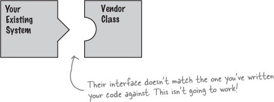
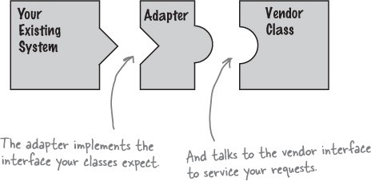
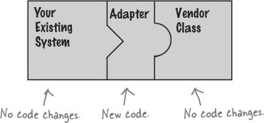
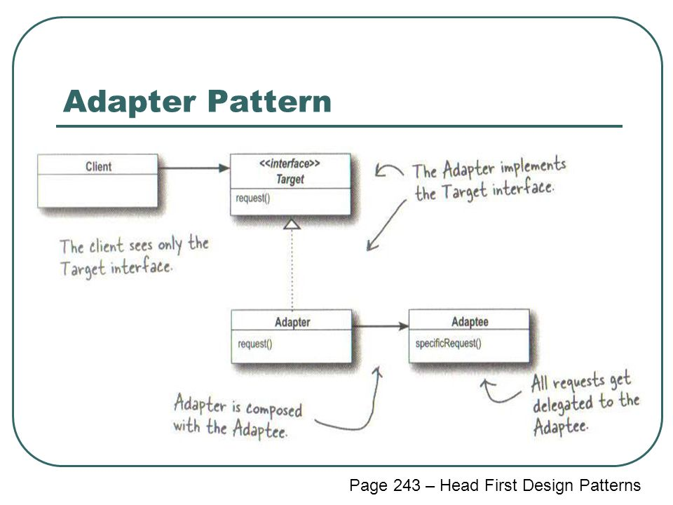

# Adapter
In the real world, adapters are used everywhere. For instance, to charge your laptop while traveling abroad, an adapter is required because of the different shapes and sizes of foreign sockets.

The travel adapter converts the foreign socket and adapts it to the charger that the laptop expects, it allows the charger and the foreign socket to work together without changing them.


In design patterns, the adapter pattern takes the same idea and apply it to object-orientated programming. The adapter converts an interface and adapts it to another interface that the client expects, it allows classes to work together without changing the interfaces.


## Why use adapters?
Before getting into the definition, it's important to understand why adapters are needed.

Let's say we're working on a software system, and it's required to integrate an new third party library into the system, but the new vendor's interface is different from last vendor.

The problem is, the interface of the system expects is different from the interface that the third party library provides. Obviously, the implementation of the third party lib interface can not be changed. But the existing code can not be changed either, as other internal components depend on it.



To put it more concisely, there exists the problem of incompatible interfaces.

In this scenario, an adapter is needed to adapt to the third party lib interface. So it acts as a middle man between the system and third party lib, converting requests from the existing system to something the third party lib can understand.



In other words, the adapter takes an interface and adapt it to another interface that the client expects, without changing the interfaces.



## An code example: modified from [1]

Let's say there's a `Main` class representing our software system.
```java
public class Main {
	public static void main(String[] args) {
		// Old objects
		Line line = new Line();
		Rectangle rectangle = new Rectangle();
		Circle circle = new Circle();
		
		// Adapt them with adapters
		List<Shape> shapes = new ArrayList<Shape>();
		shapes.add(new LineAdapter(line));
		shapes.add(new RectangleAdapter(rectangle));
		shapes.add(new CircleAdapter(circle));
		
		// Code can now operate using common interface
		int x1 = 7;
		int y1 = 23;
		int x2 = 37;
		int y2 = 70;
		for (Shape shape : shapes) {
			shape.draw(x1, y1, x2, y2);
		}
	}
}
```

```java
public interface Shape {
	void draw(int x1, int y1, int x2, int y2);
}
```
As we observe, our system expects to work with the `Shape` interface.

But if we look into `Line`, `Rectangle` and `Circle` Classes, they do not implement the `Shape` interface. These classes can not implement the `Shape` interface, as they represent the external lib.
```java
public class Line {
	public void draw(int x1, int y1, int x2, int y2) {
		System.out.println("Line from point A(" + x1 + ";" + y1 + "), to point B(" + x2 + ";" + y2 + ")");
	}
}
```

```java
public class Rectangle {
	public void draw(int x, int y, int width, int height) {
		System.out.println("Rectangle with coordinate left-down point (" + x
				+ ";" + y + "), width: " + width + ", height: " + height);
	}
}
```

```java
public class Circle {
	public void draw(int x, int y, int radius) {
		System.out.println("Circle with centre at (" + x
				+ ";" + y + "), with a radius of " + radius);
	}
}
```

But how do we add `Line`, `Rectangle` and `Circle` instances to `Shape` list? And call `shape.draw(x1, y1, x2, y2)`?

**We create adapters for `Line`, `Rectangle` and `Circle`.**

`LineAdapter`, `RectangleAdapter` and `CircleAdapter` implements `Shape` and compose of `Line`, `Rectangle` and `Circle` instances respectively.

```java
public class LineAdapter implements Shape {
	private Line adaptee;
	
	public LineAdapter(Line line) {
		this.adaptee = line;
	}
	
	@Override
	public void draw(int x1, int y1, int x2, int y2) {
		adaptee.draw(x1, y1, x2, y2);
	}
}
```
```java
public class RectangleAdapter implements Shape {
	private Rectangle adaptee;
	
	public RectangleAdapter(Rectangle rectangle) {
		this.adaptee = rectangle;
	}
	
	@Override
	public void draw(int x1, int y1, int x2, int y2) {
		int x = Math.min(x1, x2);
		int y = Math.min(y1, y2);
		int width = Math.abs(x2-x1);
		int height = Math.abs(y2-y1);
		
		adaptee.draw(x, y, width, height);
	}
}
```
```java
public class CircleAdapter implements Shape {
    private Circle adaptee;

    public CircleAdapter(Circle circle) {
        this.adaptee = circle;
    }

    @Override
    public void draw(int x1, int y1, int x2, int y2) {
        // Assumes that the 2 points are the end points of the diameter
        int centerX = (x1 + x2) / 2;
        int centerY = (y1 + y2) / 2;
        int radius = (int) round(sqrt(pow(abs(x2 - x1), 2) + pow(abs(y2 - y1), 2)) / 2);
        adaptee.draw(centerX, centerY, radius);
    }
}
```

In the `Main` class, we adapt the `Line`, `Rectangle` and `Circle` instances, so they can be added and used by `Shape` list.
```java
public class Main {
	public static void main(String[] args) {
		// Old objects
		Line line = new Line();
		Rectangle rectangle = new Rectangle();
		Circle circle = new Circle();
		
		// Adapt them with adapters
		List<Shape> shapes = new ArrayList<Shape>();
		shapes.add(new LineAdapter(line));
		shapes.add(new RectangleAdapter(rectangle));
		shapes.add(new CircleAdapter(circle));
		
		// Code can now operate using common interface
		int x1 = 7;
		int y1 = 23;
		int x2 = 37;
		int y2 = 70;
		for (Shape shape : shapes) {
			shape.draw(x1, y1, x2, y2);
		}
	}
}
```

## Adapters definition
Now that the concept of adapter pattern is understood, it's time to put into a formal definition.

> The Adapter Pattern converts the interface of a class into another interface the clients expect. Adapter lets classes work together that couldn't otherwise because of incompatible interface [2]

### Participants of the Adapter Pattern
- **Client**
    - Collaborates with objects conforming to the target interface.
    - It's the `Main` class from the example above.
- **Target**
    - Defines the application-specific interface that clients use.
    - It's the `Shape` interface.
- **Adaptee**
    - Defines an existing interface that needs adapting.
    - `Line`, `Rectangle` and `Circle` Classes, in real world they could also be interfaces or abstract classes.
- **Adapter**
    - Adapts the interface of the adaptee to the target interface.
    - `LineAdapter`, `RectangleAdapter` and `CircleAdapter` Classes.

### Adapter pattern class diagram [2]


## Object Adapter and Class Adapter
The example demonstrated is made with object adapter pattern, because it compose of the adaptee instance. Since Java does not allow multi-inheritance, therefore this is the only adapter method that can be used. But if a multi-inheritance language is used, such as C++. There's also the option of class adaptors, which subclass the Target and the Adaptee.

### Object Adapter vs. Class Adapter class diagram [3]


## Adapter pattern in Android
The most common usage of the adapter pattern in Android development is for RecyclerView.

> RecyclerView uses an adapter to transform app data into something the RecyclerView can display, without changing how the app stores and processes the data. [4]

>The adapter connects your data to the RecyclerView. It adapts the data so that it can be displayed in a ViewHolder. A RecyclerView uses the adapter to figure out how to display the data on the screen. [4]

### Android code example

Here, the fragment is used to display a list of recipes.

In the `setupRecyclerView()` method, the `recipeListAdapter` is set
to `recipeList` (a RecyclerView instance).

RecipeListFragment is the **client**, it expects an **target** interface of ```RecyclerView.Adapter<VH extends ViewHolder>``` (It's actually an abstract static class, from now on, it will be called **target** abstract class). It expect this **target** abstract class because ```recyclerView.setAdapter()``` accepts only instance that implements ```RecyclerView.Adapter<VH extends ViewHolder>```
```java
public class RecipeListFragment extends Fragment {

    private RecipeListLayoutBinding binding;
    private RecipeListAdapter recipeListAdapter;

    @Nullable
    @Override
    public View onCreateView(@NonNull LayoutInflater inflater, @Nullable ViewGroup container, @Nullable Bundle savedInstanceState) {
        binding = RecipeListLayoutBinding.inflate(inflater, container, false);

        setupRecyclerView();
        return binding.getRoot();
    }

    private List<Recipe> buildMockList() {
        String url = "url";
        String title = "Pasta";
        String caption = "Simple recipe for simple forks";
        String body = "Pasta cooking instructions";

        List<Recipe> mockRecipeList = new ArrayList<>();

        for (int i = 0; i < 20; i++) {
            mockRecipeList.add(new Recipe(url, title + " " + i, caption + " " + i, body));
        }

        return mockRecipeList;
    }

    private void setupRecyclerView() {
        binding.recipeList.setLayoutManager(new LinearLayoutManager(getContext()));

        List<Recipe> mockRecipeList = buildMockList();

        recipeListAdapter = new RecipeListAdapter(mockRecipeList);
        binding.recipeList.setAdapter(recipeListAdapter);
    }

}
```
Here, the `List<Recipe>` is the **adaptee**.
```java

public class Recipe {
    private String bannerUrl;
    private String title;
    private String caption;
    private String body;

    public Recipe(String bannerUrl, String title, String caption, String body) {
        this.bannerUrl = bannerUrl;
        this.title = title;
        this.caption = caption;
        this.body = body;

    public void setBannerUrl(String bannerUrl) {
        this.bannerUrl = bannerUrl;
    }

    public void setTitle(String title) {
        this.title = title;
    }

    public void setCaption(String caption) {
        this.caption = caption;
    }

    public void setBody(String body) {
        this.body = body;
    }

    public String getBannerUrl() {
        return bannerUrl;
    }

    public String getTitle() {
        return title;
    }

    public String getCaption() {
        return caption;
    }

    public String getBody() {
        return body;
    }
}
```

RecipeListAdapter is the **adapter** that adapts the **adaptee** `List<Recipe>` (composition, object adapter) to **target** ```RecyclerView.Adapter<VH extends ViewHolder>```.

Since the adapter implemented the **target** abstract class ```RecyclerView.Adapter<VH extends ViewHolder>```, it has to implement the `onCreateViewHolder`, `onBindViewHolder`, `getItemCount` abstract methods. 

Additionally, the adapter also need to implement a static class `RecipeViewHolder` that extends `RecyclerView.ViewHolder`. Hence why the `RecipeListAdapter` actually extends ```RecyclerView.Adapter<RecipeListAdapter.RecipeViewHolder>```
```java
public class RecipeListAdapter extends RecyclerView.Adapter<RecipeListAdapter.RecipeViewHolder> {

    private List<Recipe> recipeList;

    public RecipeListAdapter(List<Recipe> recipeList) {
        this.recipeList = recipeList;
    }

    public static class RecipeViewHolder extends RecyclerView.ViewHolder {

        private RecipeListItemBinding binding;

        public RecipeViewHolder(RecipeListItemBinding binding) {
            super(binding.getRoot());
            this.binding = binding;
        }

        public void bind(Recipe recipe) {
            binding.title.setText(recipe.getTitle());
            binding.body.setText(recipe.getBody());
            binding.caption.setText(recipe.getCaption());
            Glide.with(binding.getRoot().getContext())
                    .load(recipe.getBannerUrl())
                    .into(binding.banner);
        }
    }
    
    @NonNull
    @Override
    public RecipeViewHolder onCreateViewHolder(@NonNull ViewGroup parent, int viewType) {
        RecipeListItemBinding binding = RecipeListItemBinding.inflate(LayoutInflater.from(parent.getContext()), parent, false);
        return new RecipeViewHolder(binding);
    }

    @Override
    public void onBindViewHolder(@NonNull RecipeViewHolder holder, int position) {
        Recipe recipe = recipeList.get(position);
        holder.bind(recipe);
    }

    @Override
    public int getItemCount() {
        return recipeList.size();
    }

    public void submitNewList(List<Recipe> recipeList) {
        this.recipeList = recipeList;
        notifyDataSetChanged();
    }
}
```

This is how the `RecyclerView` adapter adapts the data `List<Recipe>` to be displayed in a `ViewHolder` (`RecipeViewHolder`).

## References
[1] E. Freeman and E. Freeman, Head first design patterns. [Sebastopol, CA]: O'Reilly Media, 2005.

[2] S. McIntosh, "smcintosh/adapter-exercise", GitHub, 2020. [Online]. Available: https://github.com/smcintosh/adapter-exercise. [Accessed: 19- Jul- 2020].

[3] "Adapter pattern", En.wikipedia.org, 2020. [Online]. Available: https://en.wikipedia.org/wiki/Adapter_pattern#/media/File:W3sDesign_Adapter_Design_Pattern_UML.jpg. [Accessed: 19- Jul- 2020].

[4]"Android Kotlin Fundamentals 07.1: RecyclerView fundamentals", Codelabs.developers.google.com, 2020. [Online]. Available: https://codelabs.developers.google.com/codelabs/kotlin-android-training-recyclerview-fundamentals/#2. [Accessed: 19- Jul- 2020].
